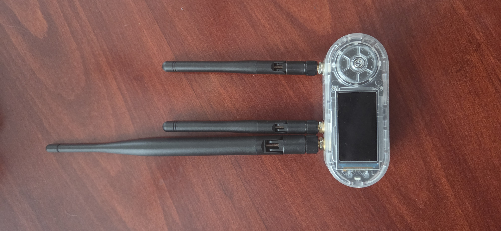
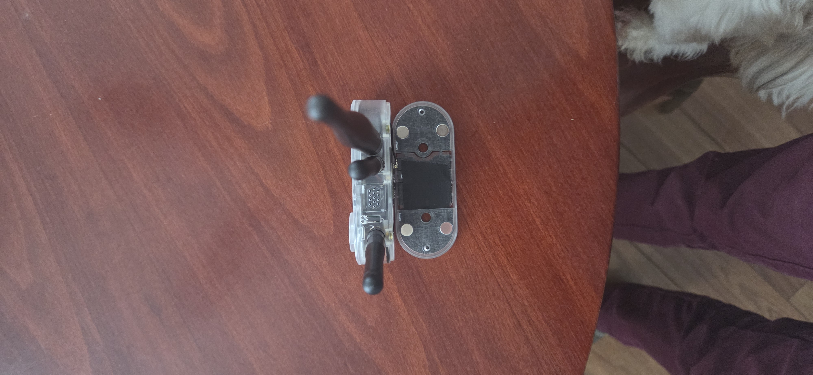
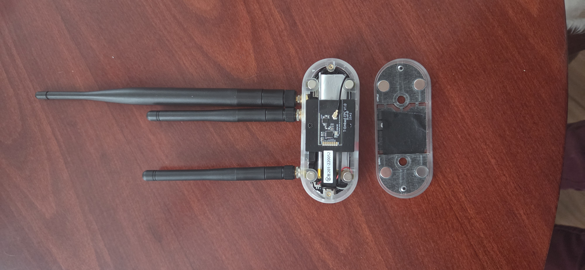

# T-Embed CC1101 plus External Antenna Mod

This project documents a hardware modification for the LilyGo T-Embed CC1101 plus to replace the stock internal antennas with high-gain external antennas. This modification significantly improves signal range and stability for both LoRa/Sub-GHz (915MHz) and Wi-Fi/Bluetooth (2.4GHz) communications.

---

** *!DO NOT POWER ON WHILE DOING THIS MODIFICATION UNTIL ANNTENNAS ARE ATTACHED!* **

---

## 📸 The Finished Mod

*Front view showing the triple antenna setup.*

*Top profile showing the custom mounting points.*

## 🛠 Hardware Required

**1. The Device**
* **LilyGo T-Embed CC1101** (plus Version)
https://www.lilygo.cc/products/t-embed-cc1101-plus?bg_ref=jQeRpxT55e

**2. Antennas**
* **2.4GHz High Gain Antennas (Qty: 2):** Used for Wi-Fi and Bluetooth.
    * [Amazon Link](https://a.co/d/5IQl2xi)
* **915MHz High Gain Antenna (Qty: 1):** Used for LoRa/Meshtastic communication.
    * [Amazon Link](https://a.co/d/8Ta44NI)

**3. Internal Connectors (Crucial)**
* **U.FL to SMA Female Pigtails (Qty: 3):** These are required to connect the board's internal U.FL ports to the external antennas. *Ensure the cable length is short (approx 5-10cm) to fit inside the case.*

---

## ⚙️ Installation Guide

### Step 1: Disassembly
Remove the rear cover to access the internal components. Be careful with the battery wires and the FPC ribbon cable connecting the screen/dial.

### Step 2: Case Modification
1.  Mark three evenly spaced points on the top plastic rim of the T-Embed case.(I suggest keeping the 2.4ghz together to stop interference)
2.  Drill holes sized to fit the SMA connectors (usually 6mm or 1/4").
3.  Ensure there is clearance inside the case for the connector barrels so they don't crush the PCB.(dont use a big drill use a dremel)

### Step 3: Wiring
1.  **LoRa (915MHz):** Locate the U.FL connector on the CC1101 module (the smaller daughterboard) and connect one pigtail.
2.  **Wi-Fi/BT (2.4GHz):** Locate the ESP32 U.FL connector on the main PCB. Disconnect the stock internal flex antenna and connect the new pigtail.
3.  **Mounting:** Secure the SMA connectors to the drilled holes using the nuts and washers provided with your pigtails.

### Step 4: Reassembly
Route the cables carefully around the battery to ensure the case closes flush. Screw the back cover back on and attach your antennas or just use the magnets attached.

## 🚀 Results

* **Signal Strength:** Significant dB gain over stock internal FPC antennas.

* **Versatility:** Allows for swapping antennas based on use case (e.g., directional vs. omnidirectional,different lengths for range capabilities).

## 🎬 Real-World Application: Film & TV Production

**The Problem**
Modern film sets are cluttered with dozens of proprietary wireless remotes for different departments: lighting (DMX), practical effects (fog machines, rain rigs, pyrotechnics), and motion control systems. Furthermore, sound stages are often RF-hostile environments saturated with 2.4GHz interference, making standard internal antennas unreliable for critical cues.

**The Solution**
This modified T-Embed serves as a **Universal Long-Range Production Controller**.

* **Consolidation:** The rotary encoder is ideal for fine-tuning variables (e.g., dimming lights, adjusting fan speeds for wind effects) without needing to look down at a touchscreen, while the display provides feedback on current settings.

* **Reliability:** By upgrading to external antennas, this device allows for the use of **915MHz LoRa** for critical "GO" triggers. This frequency punches through set walls and ignores the 2.4GHz noise floor that plagues standard Wi-Fi equipment.

* **Range:** The high-gain antennas allow the controller to operate from "Video Village" or off-camera positions that are hundreds of feet away from the practical effects being triggered.
* 
---
[real world use videos and step by step video documentation of installation coming soon]

**future versions hope to include meshtastic
for seamless onset communication**
---

*Created by [jamiemadde-max]*
---

**optional firmware **

*currently testing with the /bruce1.13
but have plans to develop my own os to see info about bruce firmware please see the /brucefirmware git hub page 

for TV and film use .

