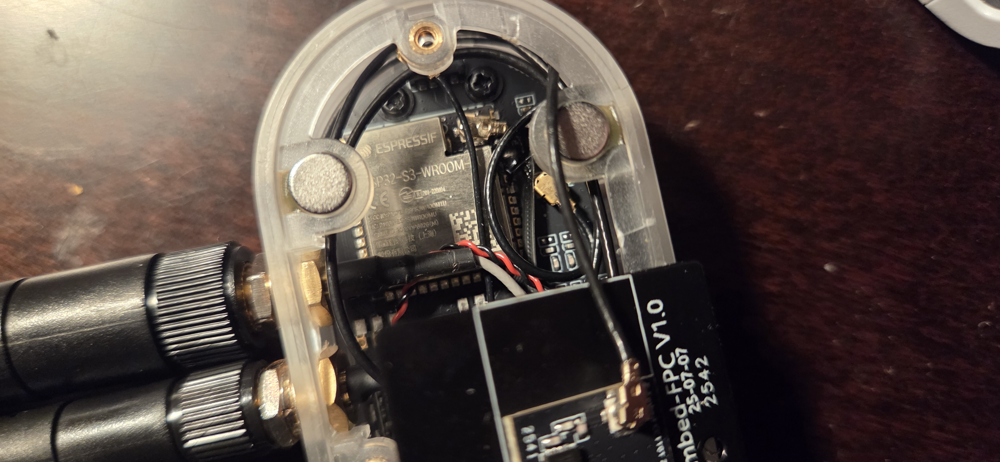
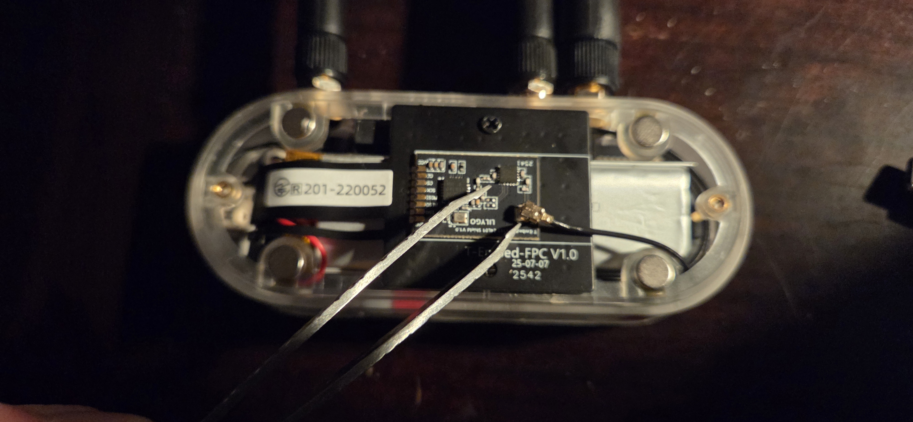
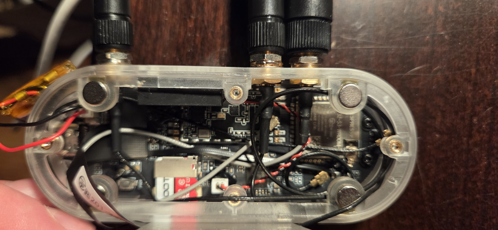

# T-Embed CC1101 Plus: External Antenna Modification

This project documents a hardware modification for the **LilyGo T-Embed CC1101 Plus** to replace the stock internal antennas with high-gain external antennas. This modification significantly improves signal range and stability for both LoRa/Sub-GHz (915MHz) and Wi-Fi/Bluetooth (2.4GHz) communications.

---

### ⚠️ CAUTION
**DO NOT POWER ON THE DEVICE UNTIL ALL ANTENNAS ARE ATTACHED.**
> Powering on the RF modules without antennas connected can permanently damage the transmission chips.

---

## 📸 The Finished Mod

*Front view showing the triple antenna setup.*

*Top profile showing the custom mounting points.*

## 🛠 Hardware Required

**1. The Device**
* **LilyGo T-Embed CC1101 (Plus Version):** [Product Link](https://www.lilygo.cc/products/t-embed-cc1101-plus?bg_ref=jQeRpxT55e)

**2. Antennas**
* **2.4GHz High Gain Antennas (Qty: 2):** Used for Wi-Fi and Bluetooth. [Amazon Link](https://a.co/d/5IQl2xi)
* **915MHz High Gain Antenna (Qty: 1):** Used for LoRa/Meshtastic communication. [Amazon Link](https://a.co/d/8Ta44NI)

**3. Internal Connectors (Crucial)**
* **U.FL to SMA Female Pigtails (Qty: 3):** Required to connect the board's internal U.FL ports to the external antennas.
    * *Note: Ensure cable length is short (approx. 5-10cm) to fit inside the case.*

---

## ⚙️ Installation Guide

### Step 1: Disassembly
Remove the rear cover to access the internal components.
> **Warning:** Be extremely careful with the battery wires and the FPC ribbon cable connecting the screen and rotary dial.

### Step 2: Case Modification
1.  **Mark:** Mark three evenly spaced points on the top plastic rim of the T-Embed case.
    * *Tip: I suggest keeping the two 2.4GHz antennas grouped together to minimize interference with the LoRa antenna.*
2.  **Drill:** Create holes sized to fit the SMA connectors (usually 6mm or 1/4").
    * *Recommendation: Do not use a large standard drill bit as it may crack the case. A Dremel or step bit is highly recommended.*
3.  **Clearance Check:** Ensure there is clearance inside the case for the connector barrels so they do not crush the PCB upon reassembly.

### Step 3: Wiring
1.  **LoRa (915MHz):** Locate the U.FL connector on the CC1101 module (the smaller daughterboard) and connect one pigtail.
2.  **Wi-Fi/BT (2.4GHz):** Locate the ESP32 U.FL connector on the main PCB. Disconnect the stock internal flex antenna and connect the new pigtail.
3.  **Mounting:** Secure the SMA connectors to the drilled holes using the nuts and washers provided with your pigtails.

*The RF connections are located at the very bottom of the assembly.*

*Note: One 2.4GHz connection is located under the silver ESP32 shielding, and the other is on the nRF board.*

*Note: The RF ports are labeled on the PCB, making reconnection straightforward.*

### Step 4: Reassembly
Route the cables carefully around the battery to ensure the case closes flush. Screw the back cover on and attach your antennas (or use the attached magnets for mounting).

---

## 🚀 Results

* **Signal Strength:** Significant dB gain over stock internal FPC antennas.
* **Versatility:** Allows for swapping antennas based on use case (e.g., switching to directional antennas or different lengths for specific range capabilities).

---

## 🎬 Real-World Application: Film & TV Production

### The Problem
Modern film sets are cluttered with dozens of proprietary wireless remotes for different departments: lighting (DMX), practical effects (fog machines, rain rigs, pyrotechnics), and motion control systems. Furthermore, sound stages are often RF-hostile environments saturated with 2.4GHz interference, making standard internal antennas unreliable for critical cues.

### The Solution
This modified T-Embed serves as a **Universal Long-Range Production Controller**.

* **Consolidation:** The rotary encoder is ideal for fine-tuning variables (e.g., dimming lights, adjusting fan speeds for wind effects) without needing to look down at a touchscreen, while the display provides tactile feedback.
* **Reliability:** By upgrading to external antennas, this device allows for the use of **915MHz LoRa** for critical "GO" triggers. This frequency punches through set walls and ignores the 2.4GHz noise floor that plagues standard Wi-Fi equipment.
* **Range:** The high-gain antennas allow the controller to operate from "Video Village" or off-camera positions that are hundreds of feet away from the practical effects being triggered.

---

*[Real-world use videos and step-by-step video documentation coming soon]*

**Future versions hope to include Meshtastic for seamless on-set communication.**

---

### 💻 Firmware
* Currently testing with **Bruce v1.13**.
* Plans to develop a custom OS specifically for production environments.
* For info on the current firmware, please see the [Bruce Firmware GitHub](https://github.com/pr3y/bruce).

---

## 🎬 Real-World Application: Film & TV Production

**The Problem**
Modern film sets are cluttered with dozens of proprietary wireless remotes for different departments: lighting (DMX), practical effects (fog machines, rain rigs, pyrotechnics), and motion control systems. Furthermore, sound stages are often RF-hostile environments saturated with 2.4GHz interference, making standard internal antennas unreliable for critical cues.

**The Solution**
This modified T-Embed serves as a **Universal Long-Range Production Controller**.

* **Consolidation:** The rotary encoder is ideal for fine-tuning variables (e.g., dimming lights, adjusting fan speeds for wind effects) without needing to look down at a touchscreen, while the display provides feedback on current settings.

* **Reliability:** By upgrading to external antennas, this device allows for the use of **915MHz LoRa** for critical "GO" triggers. This frequency punches through set walls and ignores the 2.4GHz noise floor that plagues standard Wi-Fi equipment.

* **Range:** The high-gain antennas allow the controller to operate from "Video Village" or off-camera positions that are hundreds of feet away from the practical effects being triggered.
* 
---

**Created by [jamiemadde-max]**
*Released under the MIT License*

